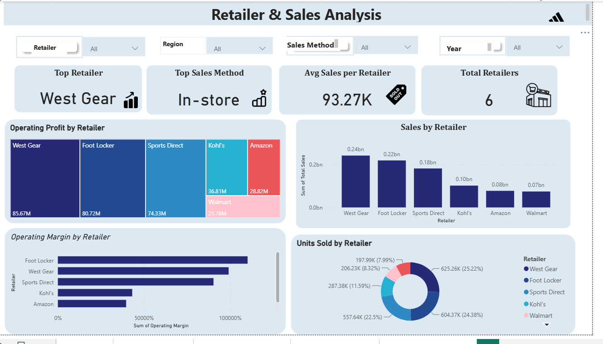

# Adidas Sales Analytics - Final Project

This repository contains the full workflow, dataset, and analysis for our Data Analysis Final Project. We explored the Adidas Sales dataset to uncover sales trends, retailer performance, and regional insights.

## 👥 Team Members (Team 1)
* Mahmoud Ahmed Mazhar
* Ziad Rabie Abdelghafar
* Diaa Abdelnaby Elshahat
* Rokia Talaat Abdelatif

## 🛠️ Tools & Technologies Used
* **Data Preprocessing & Cleaning:** Python / Excel
* **Database Management & Queries:** SQL
* **Data Visualization & Dashboards:** Power BI
* **Documentation & Presentation:** Microsoft Word, PowerPoint

## 📂 Project Workflow (Methodology)
1. **Data Cleaning:** Imported the raw dataset and cleaned it using Python and Excel to handle missing values, correct data types, and prepare it for analysis.
2. **Data Exploration (SQL):** Loaded the cleaned data into a relational database and wrote SQL scripts to answer core business questions (e.g., top performing retailers, regional sales methods, total operating profit).
3. **Data Visualization (Power BI):** Designed interactive dashboards to visually translate the SQL insights. Implemented custom KPIs, Treemaps, and Donut charts to highlight retailer and sales method performance.

## 📊 Dashboards & Insights

Here is a look at our final interactive dashboards:

### 1. Executive Overview
*(Provides a high-level summary of total sales, profit, and overall company performance)*

### 2. Regional Performance
*(Provides a geographical breakdown of sales across different regions and cities)*

### 3. Product & Sales Analysis
*(Highlights the performance of different Adidas apparel and footwear products)*

### 4. Retailer & Sales Analysis
*(Focuses on retailer performance, answering SQL questions related to operating profit and units sold by sales method)*

---
*(Note: Download the `.pbix` file to interact with the full dashboards and apply filters)*
